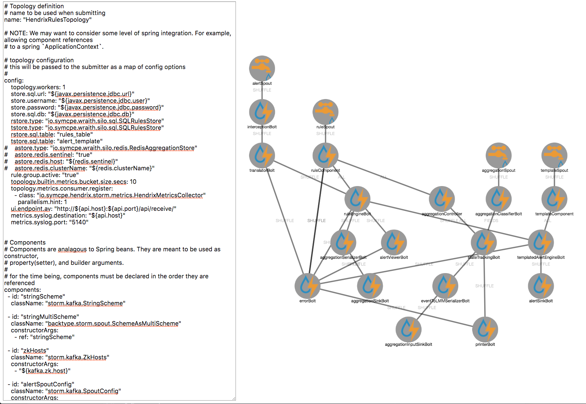

# Flux Viewer

This is a simple browser visualization to edit Storm Flux files YAML and validate the logical layout of the topology prior to deployments.

# Installation

Simply deploy the contents of this folder to a webserver

# Example

This is how the UI looks

# License

Copyright 2017 Ambud Sharma

Licensed under the Apache License, Version 2.0 (the "License");
you may not use this file except in compliance with the License.
You may obtain a copy of the License at

    http://www.apache.org/licenses/LICENSE-2.0

Unless required by applicable law or agreed to in writing, software
distributed under the License is distributed on an "AS IS" BASIS,
WITHOUT WARRANTIES OR CONDITIONS OF ANY KIND, either express or implied.
See the License for the specific language governing permissions and
limitations under the License.
